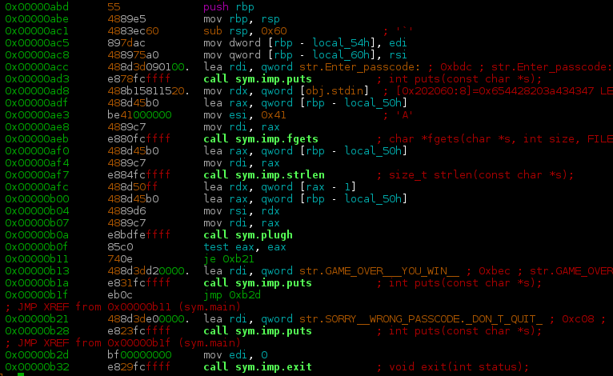
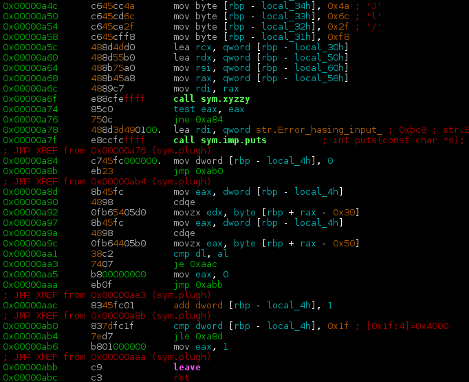
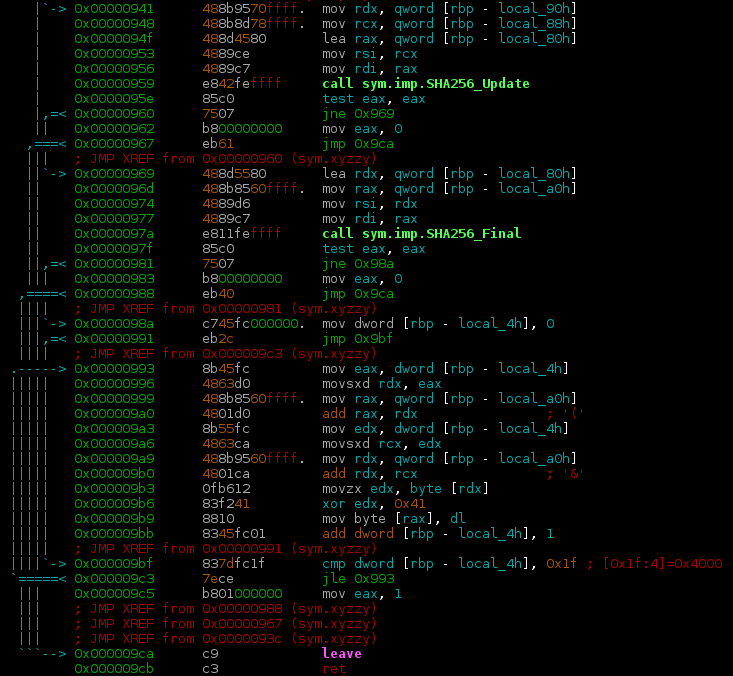
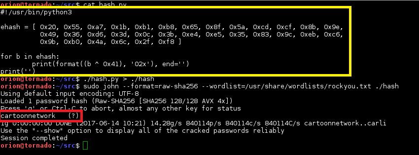
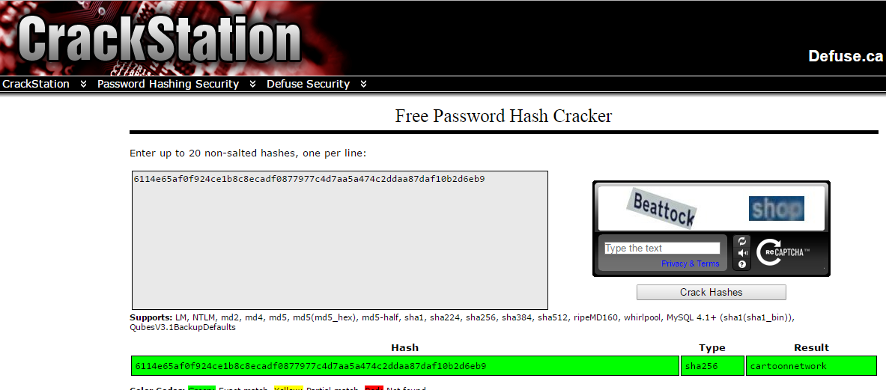
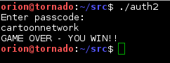

Category: Enumeration and Exploitation

Difficulty: Hard

The auth2 binary can be identified as a 64-bit ELF compiled on GNU/Linux
using the file command on Kali Linux. Executing the file prompts the
user for a passcode and responds with the message “WRONG PASSCODE. DON’T
QUIT!” Using a disassembler or debugger, such as objdump, gdb, or
radare2, the file’s 64-bit assembly language instructions can be
analyzed. Radare2 is used in this solution.

Figure : Function main()

Examination of the main() function (Fig. 1) reveals the program prints a
passcode prompt, reads user input using fgets(), and then calls another
function, plugh(), passing the user’s input as the only parameter (rbp –
local\_50h).

The plugh() function (Fig. 2) moves a bunch of single bytes into the
stack area and then calls the xyzzy() function, again passing the user’s
input along (rbp – local\_58h). Upon returning from xyzzy(), a loop is
entered that does a byte-by-byte comparison of two memory regions on the
stack (rbp + rax - 0x50 and rbp + rax – 0x30).

Figure : Function plugh()

The xyzzy() function (Fig. 3) looks interesting! It appears to be
calculating the SHA256 hash of the user’s input (rbp – local\_58h). A
quick Google of the function names SHA256\_Update() and SHA256\_Final()
reveals these are part of the OpenSSL library of cryptographic
functions.

Figure : Function xyzzy()

At this point we know that the user’s input is being hashed with SHA256.
Let’s look at what is happening to the hash value. According to the
OpenSSL sha256.c source code
(<https://github.com/openssl/openssl/blob/master/crypto/sha/sha256.c>),
SHA25\_Final() receives two parameters. The first is a pointer to a
variable that will hold the hash value. The second is the SHA256Context,
which is only important for OpenSSL’s internal workings. The Linux x64
ABI (<http://refspecs.linuxbase.org/elf/x86-64-abi-0.99.pdf>), which
defines how parameters are passed, states the first four parameters of a
function call are passed using registers: rdi, rsi, rdx, rcx. Looking at
the xyzzy() function at the point where SHA256\_Final() is called, rdi
is loaded with the address stored at rbp – local\_a0h. This is where the
result of the hash calculation is being stored. After finalizing the
hash calculation with SHA256\_Final(), the code loops a total of 32
(0x1f + 1) times, each time performing an xor operation. It gets a byte
from the stack (base address stored at rbp – local\_a0h plus an offset
being that is incremented with each iteration and stored at rbp –
local\_4h), xor’s it with 0x41, and overwrites the original byte on the
stack with the new value. This means that the result of the SHA256 hash
calculation is encrypted using a single byte xor operation with the key
0x41. When program flow returns to plugh() that encrypted hash value is
compared, byte-by-byte, with the static values moved into the stack area
at the beginning of the plugh() function. If all the bytes match, this
triggers the “GAME OVER – YOU WIN!” message. Those static values must be
the xor encrypted SHA256 hash value of the correct passcode (Fig. 4).

Figure : Xor encrypted SHA256 value of passcode

Since the xor operation is its own inverse, xoring each byte indicated
in Fig. 4 with 0x41 will obtain the original SHA256 hash. This can be
done with a simple python script (Fig. 5) The decrypted SHA256 value
corresponds to the input passcode that will trigger the “GAME OVER – YOU
WIN!” message.

Decrypting the encrypted hash value results in the hash:

6114e65af0f924ce1b8c8ecadf0877977c4d7aa5a474c2ddaa87daf10b2d6eb9

Crackstation.net (Fig. 6), hashcat, or John the Ripper (Fig. 5) can then
be used with the rockyou wordlist to crack the hash.

Figure 5: Python script to xor decrypt the hash and cracking the hash
with john

Figure 6: Crackstation.net

Figure : Win
